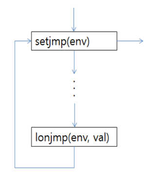

해당 글은 학부 공부를 목적으로 한 글임
정리가 되어있지 않고 정보를 나열한 형태임
정확하지 않은 정보가 있을 수 있음

## 시그널 보내기
* kill 명령어
  * 한 프로세스가 다른 프로세스를 제어하기 위해 임의의 시그널을 강제로 보냄
  * kill [-시그널] PID
  * kill -l: 시그널 리스트 보기
  * 예시: kill -KILL 1234
* kill() 시스템 호출
  * 보내는 프로세스의 소유자가 슈퍼유저이거나 받는 프로세스의 소유자와 같아야함
  * int kill(int pid, int signo)
  * pid에 sino를 보냄 성공시 0, 실패시 -1 리턴
* pid 범위에 따라 다른점
  * pid > 0: pid에 시그널 보냄
  * pid == 0: 보내는 프로세스와 같은 gid를 가진 프로세스에 시그널 보냄
  * pid < 0: pid의 절대값과 같은 gid를 가진 프로세스에 시그널 보냄
  * pid == -1: 1번 프로세스(init)을 제외한 프로세스 모두에 시그널 보냄

## 비지역 점프
* 비지역 점프란?
  * 호출자 함수내의 임의의 위치로 점프
  * 오류/예외 처리, 시그널 처리에 유용
* goto문과 비지역 점프의 차이점
  * goto문은 함수 내에서 지역 점프임(local jump)
* 비지역 점프 하는법
  * int setjmp(jmp_buf env)
    * longjmp 전에 호출되어야함
    * longjmp 할 곳을 지정
    * 처음 호출될때는 0반환, 그 다음부턴 val을 반환
  * int longjmp(jmp_buf env, int val)
    * setjmp 후 호출됨
    * setjmp로 설정된 지점으로 비지역 점프
    * 한번 호출 후 반환하지 않음
* 시그널 처리하는 예시

```c++
signal(SIGINT, inthandler);
if(setjmp(env) != 0){
    printf("인터럽트");
    exit(0);
    
}

int handler(){
    longjmp(env, 1);
}
```


